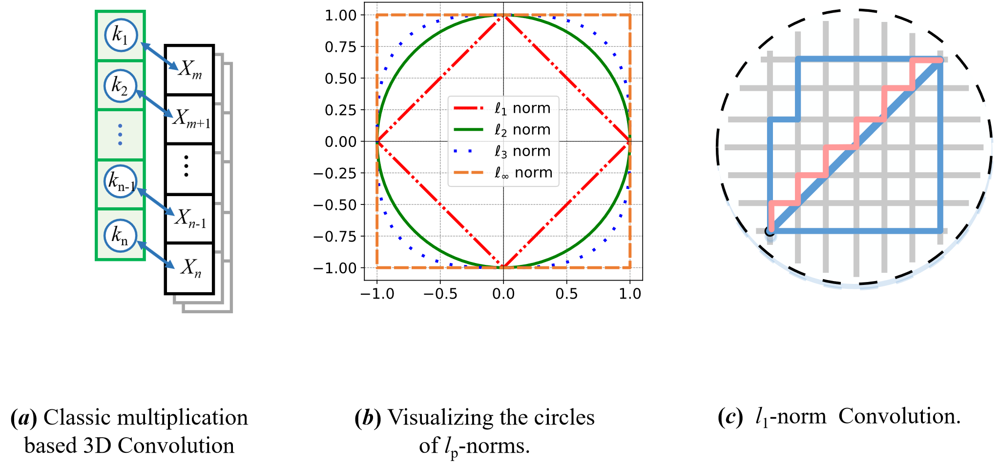

# Pytorch Implementation of **Rethinking 3D Convolution in** *ℓ**p***-norm Space ——Version 1.0

This repo is implementation for Rethinking 3D Convolution in ℓp-norm Space in pytorch.

Paper is [Here](https://proceedings.neurips.cc/paper_files/paper/2024/file/a55dd7fc416d91fbb3817defe6a75df6-Paper-Conference.pdf).



## Install
The latest codes are tested on Ubuntu 16.04, CUDA10.1, PyTorch 1.6 and Python 3.7:
```shell
conda install pytorch==1.6.0 cudatoolkit=10.1 -c pytorch
```

## Classification (ModelNet10/40)
### Data Preparation
Download alignment **ModelNet** [here](https://shapenet.cs.stanford.edu/media/modelnet40_normal_resampled.zip).

### Run
You can run different modes with following codes. 
* If you want to use offline processing of data, you can use `--process_data` in the first run. You can download pre-processd data [here](https://drive.google.com/drive/folders/1_fBYbDO3XSdRt3DSbEBe41r5l9YpIGWF?usp=sharing) and save it in `data/modelnet40_normal_resampled/`.
* If you want to train on ModelNet10, you can use `--num_category 10`.
```shell
# ModelNet40
## Select different models in ./models 

## e.g., pointnet2_ssg without normal features
python train_classification.py --model pointnet2_cls_ssg --log_dir pointnet2_cls_ssg
python test_classification.py --log_dir pointnet2_cls_ssg

## e.g., pointnet2_ssg with normal features
python train_classification.py --model pointnet2_cls_ssg --use_normals --log_dir pointnet2_cls_ssg_normal
python test_classification.py --use_normals --log_dir pointnet2_cls_ssg_normal

## e.g., pointnet2_ssg with uniform sampling
python train_classification.py --model pointnet2_cls_ssg --use_uniform_sample --log_dir pointnet2_cls_ssg_fps
python test_classification.py --use_uniform_sample --log_dir pointnet2_cls_ssg_fps

# ModelNet10
## Similar setting like ModelNet40, just using --num_category 10

## e.g., pointnet2_ssg without normal features
python train_classification.py --model pointnet2_cls_ssg --log_dir pointnet2_cls_ssg --num_category 10
python test_classification.py --log_dir pointnet2_cls_ssg --num_category 10
```


## Visualization

### Using show3d_balls.py
```
## build C++ code for visualization
cd visualizer
bash build.sh 
## run one example 
python show3d_balls.py
```

### Using MeshLab


## Citation
If you find this work helpful for your research or project, please consider citing it in your publications or references: 
```
@article{zhang2024rethinking,
  title={Rethinking 3D Convolution in $ell\_p $-norm Space},
  author={Zhang, Li and Zhong, Yan and Wang, Jianan and Min, Zhe and Liu, Liu},
  journal={Advances in Neural Information Processing Systems},
  volume={37},
  pages={91012--91035},
  year={2024}
}
```
